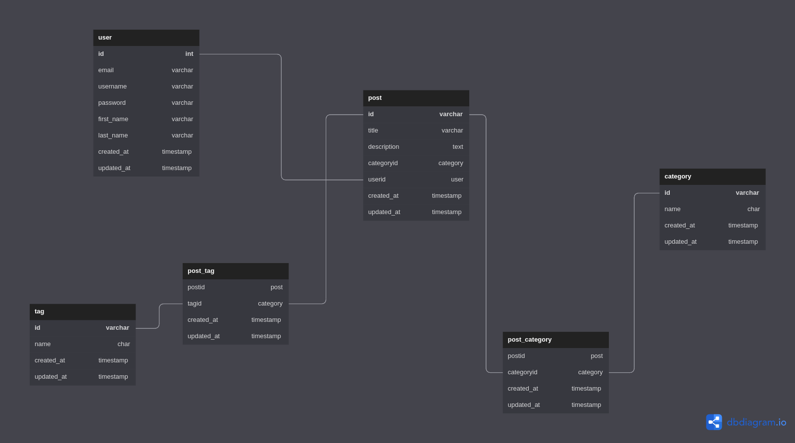

# [Backend] Xizblog

Backend of my blog.

## Installation

git clone repository

```bash
git clone https://github.com/Xizted/xizblog-backend.git
```

install dependencies

```bash
yarn install
```

## Database modeling


